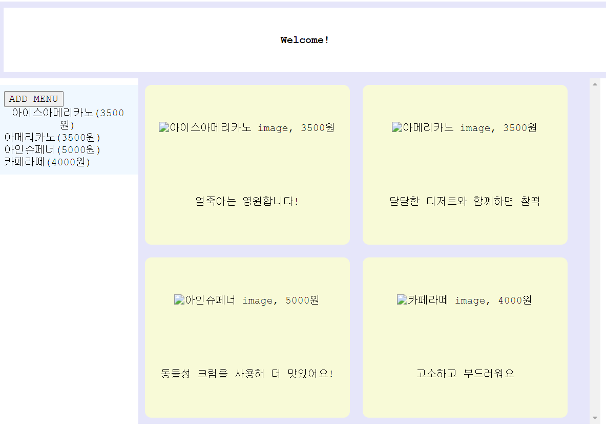
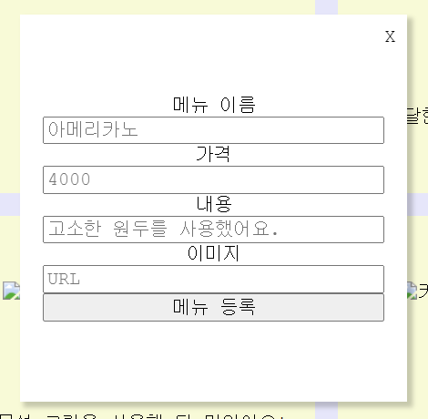

# 카페 메뉴 관리 웹페이지 만들기
- 첫 리액트 프로젝트로 반응형 웹페이지를 만들었습니다.

# 🎈목차
- 사용
- 실행 방법
- 기능 및 구현
- 트러블 슈팅
- 학습 현황

# 사용
- CRA
- react
- CSS
- https://github.com/summerydev/react-cafeMenu

---
# 실행 방법
- git clone https://github.com/summerydev/react-cafeMenu
- npm install
- npx json-server --watch ./src/db/data.json --port 3001
- npm start

---

# 기능 및 구현

- `header` , `sidebar` , `section` 의 컴포넌트 구성
- css flex 구현
- `sidebar` : 카페 메뉴 확인, 등록 가능
    - `ADD MENU` 버튼 클릭 시 모달창 열림
    - 모달창을 통해 메뉴 추가 가능
    
    
- `section` : 등록된 카페 메뉴를 `data.json` 에서 받아와 보여줌
    - 메뉴 이름, 가격, 사진, 설명 확인 가능

---

# 트러블 슈팅

## 모달창 오류

⚠️ 문제

- 모달창 열고닫기 불가능
- 컴포넌트 관리 오류로 sidebar에서 모달창이 열리고, 닫히지 않음
- 모달창에서 메뉴 등록 시 `data.json`으로 전송되지 않는 오류

🛠️ 해결

- 컴포넌트 수정 및 삭제를 통해 모달창이 전체 화면에서 열리도록 변경
- `props` 활용으로 모달창의 hidden 속성 관리
- `userState`로 input태그에 입력된 값 관리, `handleSubmit`. `handleAddItem`로 데이터 전송

🚧 해결 중인 문제

None

---

# 학습 현황

- 컴포넌트 관리
- 리액트에서 함수 동작 방식 이해
- props 사용이 많이 헷갈렸으나 약간 감을 잡음! 응용을 위해 연습이 좀 더 필요한듯
- key와 `map()` 에 대한 이해 → 응용 확장이 필요함
- json-server를 통한 REST api 구현